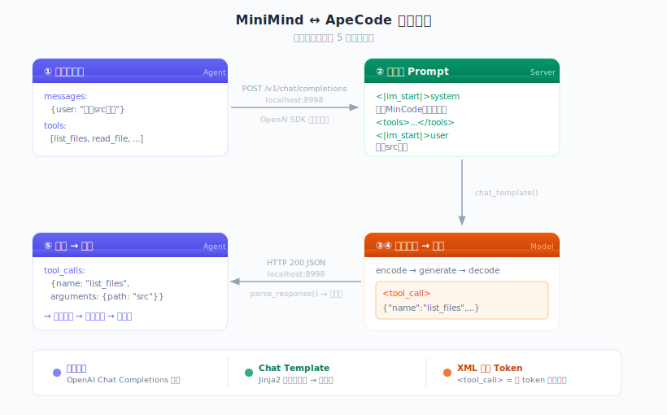

# Minicode

**将轻量语言模型与 Agent Harness 结合，通过 SFT + RL 训练使其习得工具调用能力。**

Minicode 将 [MiniMind](https://github.com/jingyaogong/minimind)（64M 参数）接入简化版 [ApeCode](https://github.com/ApeCodeAI/apecode) Agent Harness，在消费级硬件（CPU）和有限数据条件下，完成了从数据构建、LoRA 微调到 GRPO 强化学习的完整训练流程。

## 核心成果

| 阶段 | 方法 | 工具调用准确率 | 提升 |
|------|------|---------------|------|
| Base (未训练) | — | 40.0% | — |
| Phase 2: SFT v1 | LoRA, 272 样本 | 62.5% | +22.5% |
| Phase 2: SFT v2 | LoRA, 482 样本（含噪声） | 47.5% | +7.5% |
| **Phase 3: v1 → RL** | **GRPO/CISPO, 119 样本** | **80.0%** | **+17.5%** |
| Phase 3: v2 → RL | GRPO/CISPO, 119 样本 | 62.5% | +15.0% |

> 评测基于 40 条测试用例（5 类 × 8 条），与训练数据零重叠。

## 架构

```
User Input
    │
    ▼
CLI (cli.py) ──▶ Agent Loop (agent.py)
                      │
                      ▼
              Model Adapter (model_adapter.py)
                 /          \
    MiniMind API Client    Local Inference
    (OpenAI-compat)        (Direct PyTorch)
                      │
                      ▼
              Tool Execution (tools.py)
              [list_files, read_file, write_file]
```

**模型规格**: 64M 参数 | vocab=6400 | hidden=768 | 8 layers | max_seq_len=768

### MiniMind ↔ ApeCode 通讯桥梁

MiniMind 和 ApeCode 原本是两个独立项目。Minicode 的第一个工程挑战是打通二者的通讯链路——核心难点在于：模型只能输入和输出纯文本 token 序列，但 Agent 需要结构化的工具调用对象。

<p align="center">
  
</p>

**设计要点**：

- **协议对齐**：双方使用 OpenAI Chat Completions 格式通信，Agent 侧用标准 OpenAI SDK，对底层模型完全透明
- **Chat Template 是核心桥梁**：MiniMind 的 Jinja2 模板将结构化 messages + tools 渲染为模型训练时见过的纯文本格式，这是模型"理解"工具的关键——格式由 template 保证，工具选择能力由 SFT/RL 训练注入
- **XML 标签作为结构边界**：`<tool_call>` 和 `</tool_call>` 在 tokenizer 中是单个特殊 token（ID 21/22），模型只需输出一个 token 就能标记工具调用的开始和结束，服务器侧用正则提取后转为结构化 JSON

> 详细的通讯机制分析见 `docs/communication-deep-dive.md`，HTTP 桥梁的逐层拆解见 `docs/http-bridge-guide.md`。

## 项目设计

### 1. 工具与训练策略

整个训练流程在单台 Mac CPU 上完成，无需 GPU：

- **工具精简 6 → 3**：原始 ApeCode 定义了 6 个工具，但 768 token 的上下文窗口无法容纳完整的工具描述。将工具集压缩为 list_files、read_file、write_file 三个核心文件操作，既降低了系统提示词的 token 开销，也减少了模型需要区分的类别数量。
- **LoRA 而非全参数微调**：MiniMind 基座在预训练阶段已习得 `<tool_call>` 的格式范式，模型缺少的不是工具调用语法，而是将正确工具名与用户意图建立映射的能力。因此选择 LoRA（rank=16, 仅 0.4M 参数 / 0.61%），以最小参数量完成能力注入。
- **种子 + API 扩展的数据策略**：30 条手写种子样本控制质量边界，通过 DeepSeek API 扩展至 272 条，在数据成本和覆盖度之间取得平衡。
- **GRPO 全参数 RL**：RL 阶段改为全参数训练——64M 模型上 LoRA 的参数量不足以传导 RL 的稀疏奖励信号。119 条手写 prompt，3 epoch ~2h 完成。

### 2. Rule-based Reward 设计

RL 阶段不依赖神经网络奖励模型，采用结构化规则打分——在没有人类偏好数据的条件下，利用工具调用的结构化特性构建可验证的奖励信号：

| 信号 | 奖励 | 说明 |
|------|------|------|
| 工具名正确 | +2.0 | 核心信号 |
| JSON 参数有效 | +1.0 | 结构正确性 |
| 必选参数齐全 | +1.0 | 功能正确性 |
| 参数值匹配 ground truth | +1.0 | 语义正确性 |
| 正确不调用工具 | +2.0 | 抑制误触发 |
| 错误工具 / 幻觉工具名 | -1.0 / -1.5 | 惩罚混淆 |

满分 +5.0，通过 `match_args_score()` 对预测参数和 ground truth 做精确/模糊匹配。

### 3. Mock Tool Execution

RL rollout 中使用确定性 mock 替代真实工具执行，实现无副作用的多轮交互：

```python
MOCK_RESULTS = {
    "list_files": lambda args: {"files": ["README.md", "main.py", ...], "path": args["path"]},
    "read_file":  lambda args: {"content": f"# File: {args['path']}\n\nSample file content."},
    "write_file": lambda args: {"status": "ok", "bytes_written": len(args["content"])},
}
```

模型生成 `<tool_call>` → mock 执行 → 返回 `<tool_response>` → 模型继续生成，最多 3 轮。

### 4. 关键实验发现

- **数据质量 > 数据数量**：272 条高质量 SFT (62.5%) 优于 482 条含噪声数据 (47.5%)
- **RL 数据量有阈值**：39 条 RL 样本无效 (62.5% → 62.5%)，扩至 119 条后显著提升 (+17.5%)
- **SFT 质量决定 RL 上限**：同样的 RL 流程，好 SFT (62.5%) → 80%，差 SFT (47.5%) → 62.5%。RL 能稳定加 ~15%，但不能弥补 SFT 的质量缺陷
- **增量训练不可行**：小模型上只用新数据 resume 训练会导致灾难性遗忘 (73.3% → 33.3%)
- **多轮工具调用未涌现**：单轮准确但不会自发发起第二次 tool call，需专门的多轮训练数据

## 项目结构

```
Minicode/
├── src/mincode/           # Agent 框架（7 个模块）
│   ├── agent.py           #   Agent loop：LLM → tool call → execute → 循环
│   ├── model_adapter.py   #   MiniMind 适配器（API / 本地推理）
│   ├── tools.py           #   3 个内置工具定义与执行
│   ├── cli.py             #   终端 REPL 入口
│   └── ...
├── scripts/               # 训练与评测脚本
│   ├── generate_sft_data.py   # SFT 数据生成（种子 + API 扩展）
│   ├── train_lora.py          # LoRA 微调
│   ├── train_rl.py            # GRPO/CISPO 强化学习
│   └── eval_toolcall.py       # Tool-calling 评测
├── dataset/               # 训练数据（SFT 272条 + RL 119条）
├── eval/                  # 评测结果、测试集、可视化
├── docs/                  # 各阶段技术文档与日志
│   ├── progress.md            # 全项目进展记录
│   └── phase3-rl-log.md      # RL 训练详细日志
└── out/                   # 模型权重（gitignored，需自行训练）
```

## 快速开始

### 前置依赖

- Python >= 3.10
- [MiniMind](https://github.com/jingyaogong/minimind) 克隆至 `../minimind/`（sibling 目录）

```bash
# 安装依赖
pip install torch transformers

# 训练 LoRA（~30min on CPU）
python scripts/train_lora.py

# RL 训练（~2h on CPU）
python scripts/train_rl.py --from_weight mincode_v1 --output_name mincode_v1_rl2 \
    --data_path dataset/mincode_rl_combined.jsonl

# 评测
python scripts/eval_toolcall.py --weight mincode_v1_rl2
```

### 运行 Agent

```bash
# 启动 MiniMind API 服务（在 ../minimind/ 目录）
python scripts/serve_openai_api.py

# 运行 Minicode agent
python -m mincode
```

## 各阶段评测详情

### Phase 3 最优模型 (v1 RL2) 分类准确率

| 类别 | 准确率 | 说明 |
|------|--------|------|
| list_files | 7/8 (88%) | 目录查看 |
| read_file | 7/8 (88%) | 文件读取 |
| write_file | 8/8 (100%) | 文件创建/写入 |
| no_tool | 6/8 (75%) | 纯对话，不触发工具 |
| edge | 4/8 (50%) | 模糊意图、边界场景 |

### 全模型对比

```
Base (40%) ──SFT──▶ v1 (62.5%) ──RL──▶ v1_rl2 (80.0%)  ← best
                  ▶ v2 (47.5%) ──RL──▶ v2_rl  (62.5%)  ← RL 补偿 +15%，但受限于 SFT 质量
```

### SFT 质量对 RL 效果的影响（对照实验）

同样的 RL 流程（119 prompts, CISPO, 3 epochs），不同 SFT 起点：

| RL 输入 | SFT 准确率 | RL 后准确率 | RL 提升 |
|---------|-----------|------------|--------|
| v1 SFT (272 高质量样本) | 62.5% | **80.0%** | +17.5% |
| v2 SFT (482 含噪声样本) | 47.5% | 62.5% | +15.0% |

RL 在两个起点上都带来了约 +15~17.5% 的稳定提升，但无法完全弥补 SFT 阶段的质量差距。v2 RL 经过补偿后恰好追平 v1 SFT 的水平——SFT 数据质量是整个训练链路的决定性因素。

## 剩余错误分析 (v1 RL2, 8/40)

最优模型仍有 8 个错误，分为两类：

- **工具混淆 × 6**：歧义 prompt 下三个工具互相混淆，如"怎么写的"（应 read）→ 选了 write，"弄一个脚本"（应 write）→ 选了 read。这些需要语义推理能力，对 64M 模型是硬瓶颈。
- **误触发 × 2**："再见"和"lambda表达式"仍触发工具调用，模型缺乏"这不是文件操作"的判断力。

## 已知局限

- **64M 模型容量有限**：参数值生成（如文件内容）质量受限，歧义场景下工具选择仍有混淆
- **768 token 上下文**：复杂多轮对话容易超出预算
- **单轮工具调用**：能正确选择工具，但不会在一次对话中连续调用多个工具
- **中文偏向**：训练数据中英比 ~3:1，英文场景表现略弱

## 致谢

- [MiniMind](https://github.com/jingyaogong/minimind) — 64M 小语言模型，提供 base 模型与 GRPO 训练框架
- [ApeCode](https://github.com/ApeCodeAI/apecode) — 终端编程 Agent，提供 harness 架构参考

## License

[Apache-2.0](LICENSE)
