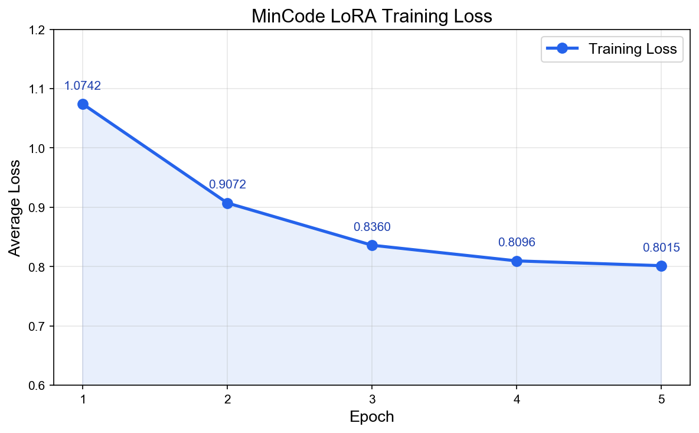
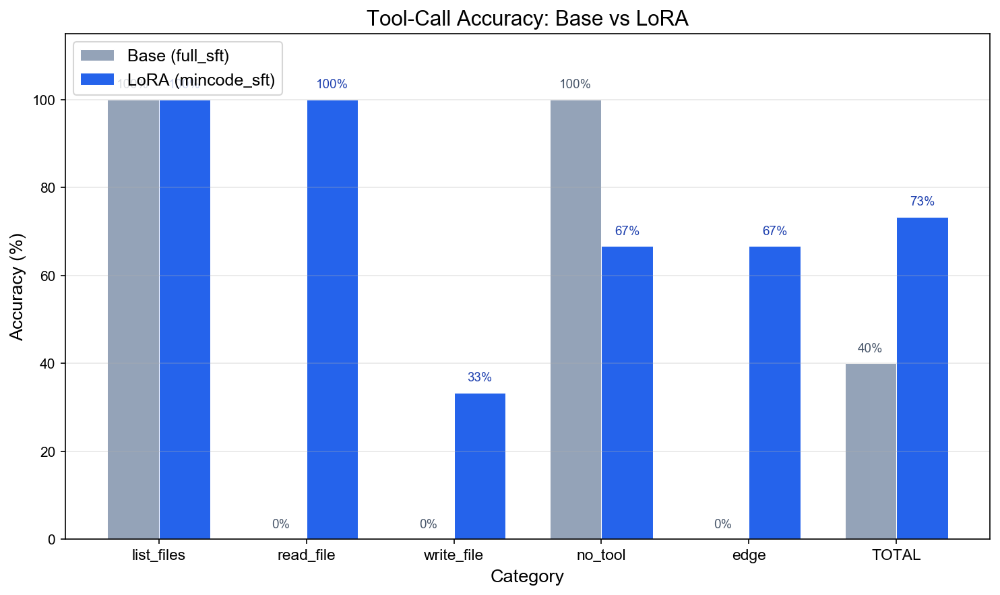

# MinCode Progress Log

> 记录 MinCode 各阶段的演进、决策与问题，方便复现和展示。

---

## Phase 1 — Harness Integration

**目标**: 将 MiniMind (64M) 接入简化版 ApeCode agent harness，验证 tool-call 链路

**时间**: 2026.05.11

**关键决策**:
- 采用 OpenAI Chat Completions 协议作为内部消息格式（MiniMind API 与 ApeCode 均使用此格式）
- MiniMind 通过 `<tool_call>` XML 标签输出工具调用，API server 解析为结构化 `tool_calls` 对象

**完成内容**:
- 构建 MinCode 项目：agent.py, model_adapter.py, tools.py, skills.py, cli.py, system_prompt.py
- 编写 CPU 兼容的 MiniMind API 启动脚本 (`scripts/start_minimind_server.py`)
- 端到端验证：模型能调用工具，但**工具名选择错误**（如用 `get_directory` 代替 `list_files`）

**遇到的问题**:
| 问题 | 原因 | 解决方案 |
|------|------|---------|
| stream 模式不兼容 | MiniMind 默认 `stream=True`，agent 期望完整响应 | 显式发送 `stream=False` |
| max_tokens 双重用途 | MiniMind 用它同时控制 prompt 截断和生成限制 | 设为 4096 作为折中 |
| System prompt 过长 | 768 token 预算下系统提示占比过高 | 压缩到 78 字符 + 中文工具描述 |
| 工具名不对 | Base 模型没学过我们的工具名 | → Phase 2 LoRA 微调 |

**结论**: 链路跑通，但 base 模型不认识我们的 3 个工具，需要 SFT。

---

## Phase 2 — LoRA Fine-tuning

**目标**: 通过 LoRA 微调教会模型正确调用 list_files / read_file / write_file

**时间**: 2026.05.12

### 2.1 策略决策

| 决策项 | 选择 | 理由 |
|--------|------|------|
| 工具数量 | 6 → 3 | exec_command 太开放，减少降低训练复杂度 |
| 训练方式 | LoRA (rank=16) | 只训 0.4M 参数 (0.61%)，不破坏 base 能力 |
| 基础权重 | minimind-3 dense (64M) | 简单稳定，不用 MoE |
| 数据来源 | 30 手写种子 + DeepSeek V4 Pro 扩展 | 种子控制质量，API 扩展数量 |
| 训练环境 | 本地 CPU | 模型够小，不需要 GPU |
| 评测方式 | 功能性测试（非 val loss） | 工具调用是结构化任务，loss 不直观 |

### 2.2 数据生成

**工具**: `scripts/generate_sft_data.py`

- 30 条手写种子样本（8 list + 8 read + 6 write + 5 对话 + 3 多轮）
- DeepSeek V4 Pro API 流式扩展，每批 10 条
- 最终: **272 条样本**

| 类别 | 数量 | 占比 |
|------|------|------|
| read_file | 119 | 43.8% |
| list_files | 77 | 28.3% |
| write_file | 58 | 21.3% |
| 纯对话 | 59 | 21.7% |
| 多轮调用 | 41 | 15.1% |

**遇到的问题**:
| 问题 | 解决方案 |
|------|---------|
| DeepSeek V4 Pro 生成慢 | prompt 从 6800→1918 字符，改为流式输出 |
| `--no_seeds` 清空文件 bug | 修改为追加模式 |
| 生成数据 content 字段为 null | 批量替换 null → 空字符串 |
| content 字段类型不一致 (list vs str) | 强制转换为 JSON 字符串 |

### 2.3 训练

**工具**: `scripts/train_lora.py`

| 参数 | 值 |
|------|-----|
| Base weight | full_sft_768.pth |
| Epochs | 5 |
| Batch size | 8 |
| Learning rate | 1e-4 (cosine schedule) |
| Max seq len | 768 |
| Steps/epoch | 34 |
| Total time | ~30 min (CPU) |

**Loss 曲线**:
```
Epoch 1: 1.0742
Epoch 2: 0.9072  ↓15.6%
Epoch 3: 0.8360  ↓7.8%
Epoch 4: 0.8096  ↓3.1%
Epoch 5: 0.8015  ↓1.0%
```



### 2.4 评测

**工具**: `scripts/eval_toolcall.py` (15 条测试用例)

| 类别 | Base (full_sft) | LoRA (mincode_sft) | 变化 |
|------|----------------|-------------------|------|
| list_files | 100% (3/3) | 100% (3/3) | = |
| read_file | 0% (0/3) | **100%** (3/3) | **+100%** |
| write_file | 0% (0/3) | 33% (1/3) | +33% |
| 纯对话 | 100% (3/3) | 67% (2/3) | -33% |
| 边界情况 | 0% (0/3) | 67% (2/3) | +67% |
| **总计** | **40.0%** | **73.3%** | **+33.3%** |



### 2.5 端到端测试

通过 MinCode harness (CLI → API server → MiniMind → tool execution) 完整跑通 4 个场景：

| 场景 | 工具选择 | 参数质量 |
|------|---------|---------|
| "看看当前目录有什么文件" | ✅ list_files | ⚠️ path 偏差 |
| "读一下README.md" | ✅ read_file | ✅ path 正确 |
| "帮我创建hello.py" | ✅ write_file | ⚠️ content 偏差 |
| "什么是Python装饰器" | ✅ 无调用 | ✅ 回答合理 |

### 2.6 当前问题

1. **write_file 准确率低 (33%)**: 训练数据中 write_file 占比不足 (21%)，模型倾向调用 list_files 或 read_file
2. **纯对话误触发 (67%)**: "你好" 这类极简输入会误触发工具调用
3. **参数质量有限**: 64M 模型生成的 path/content 参数有时不准确
4. **Python 3.9 兼容性**: CLI 使用了 3.10+ 类型注解语法，需通过 venv (3.10) 运行

---

## Phase 2.5 — 数据补强与重训练 (completed)

**目标**: 针对性补充 write_file 和纯对话数据，提升短板

**时间**: 2026.05.12

### 2.5.1 数据生成

**新数据**: `dataset/mincode_sft_v2.jsonl` — 210 条
- write_file 重点: 98 条 (10 batch × ~10)
- 纯对话: 76 条 (5 batch × ~15)
- 均衡补充: 36 条 (3 batch × ~12)

使用 `generate_sft_data.py --focus write/dialog` 新增的聚焦模式生成。

**数据质量问题** (与 v1 相同):
| 问题 | 解决方案 |
|------|---------|
| 2634 个 null 字段 | 批量替换为空字符串 |
| 空字符串 tools 导致 json.loads("") 崩溃 | 删除空 tools/tool_calls/reasoning_content 字段 |
| 15 条 tools 字段包含 `<TOOLS>` 占位符或截断 JSON | 替换为正确的 TOOLS_JSON |

### 2.5.2 增量训练实验 (失败)

**策略**: 加载 base + 已有 LoRA 权重，只用新数据继续训练

| 参数 | 值 |
|------|-----|
| 数据 | mincode_sft_v2.jsonl (210 条, 仅新数据) |
| Resume | lora_mincode_768.pth (v1 权重) |
| Epochs | 3 |
| LR | 5e-5 |
| Loss | 0.9995 → 0.9598 → 0.9505 |

**评测结果: 33.3% (↓40% vs v1 的 73.3%)**

| 类别 | v1 LoRA | 增量训练 | 变化 |
|------|---------|---------|------|
| list_files | 100% | 33% | **-67%** |
| read_file | 100% | 33% | **-67%** |
| write_file | 33% | 0% | -33% |
| no_tool | 67% | 100% | +33% |
| edge | 67% | 0% | **-67%** |

**失败原因**: **灾难性遗忘** — 只用新数据训练导致模型过度偏向 write_file，遗忘了 list_files 和 read_file 的区分能力。

### 2.5.3 合并数据全量重训 (成功)

**策略**: v1 (272) + v2 (210) = 482 条合并数据，从头训练

| 参数 | 值 |
|------|-----|
| 数据 | mincode_sft_combined.jsonl (482 条) |
| Resume | 无 (从 base 开始) |
| Epochs | 5 |
| LR | 1e-4 |
| Total time | ~72 min (CPU) |

**Loss 曲线**:
```
Epoch 1: 1.1127
Epoch 2: 0.9134  ↓17.9%
Epoch 3: 0.8475  ↓7.2%
Epoch 4: 0.8145  ↓3.9%
Epoch 5: 0.7954  ↓2.3%
```

**评测结果: 53.3%**

| 类别 | Base | v1 LoRA (272条) | v2 LoRA (482条) | 变化 (vs v1) |
|------|------|----------------|----------------|-------------|
| list_files | 100% | 100% | 100% | = |
| read_file | 0% | 100% | 67% | -33% |
| write_file | 0% | 33% | 0% | -33% |
| no_tool | 100% | 67% | 33% | -33% |
| edge | 0% | 67% | 67% | = |
| **TOTAL** | **40%** | **73.3%** | **53.3%** | **-20%** |

### 2.5.4 分析与教训

**关键发现**:
1. **增量训练不可行** (在小模型 + 小数据场景下): 新数据量与旧数据相当时，只用新数据训练会导致灾难性遗忘。必须合并全量数据重训。
2. **数据量增加反而降低准确率**: 482 条 (53.3%) < 272 条 (73.3%)。原因是新增的 DeepSeek 生成数据引入了噪声:
   - write_file 样本中 content 包含未转义双引号，模型学到了错误的 JSON 格式
   - 部分样本工具选择不一致（如 "看看 main.py" 用了 write_file）
3. **纯对话误触发加剧**: 新增对话数据未能减少误触发，反而因为工具调用样本比例增大导致模型更倾向触发工具
4. **64M 模型容量限制**: write_file 需要生成复杂的 JSON 参数（包含完整文件内容），超出了小模型的可靠生成能力

**结论**: 数据质量 > 数据数量。v1 的 272 条手工种子 + 高质量生成仍是目前最优结果。后续应优先改善数据质量而非增加数量，或转向 Phase 3 (RL) 从 reward signal 学习。

---

## Phase 3 — Agentic RL (in progress)

**目标**: 通过强化学习提升工具调用准确率

**时间**: 2026.05.12 ~ 05.13

**详细日志**: `docs/phase3-rl-log.md`

### 3.1 策略

| 决策项 | 选择 | 理由 |
|--------|------|------|
| 训练方式 | Full parameter | LoRA 参数太少，RL 信号传不下去 |
| 算法 | CISPO (MiniMind 默认) | 单侧 clip 比 PPO 更稳定 |
| Reference model | 冻结 SFT 副本 | KL 约束防止 policy collapse |
| 工具执行 | Mock (确定性) | 无副作用，CPU 友好 |
| Reward | Rule-based | 工具名 +2, JSON 有效 +1, 参数匹配 +1, gt 匹配 +1 |
| 数据 | 119 条手写 prompt | 零 overlap with eval |

### 3.2 训练结果

| 模型 | 数据 | 总准确率 | list | read | write | no_tool | edge |
|------|------|---------|------|------|-------|---------|------|
| v1 SFT (baseline) | 272 SFT | 62.5% | 62% | 62% | 75% | 75% | 38% |
| v1 RL (Run 1) | 39 RL | 62.5% | 75% | 75% | 62% | 75% | 25% |
| **v1 RL2 (Run 2)** | **119 RL** | **80.0%** | **88%** | **88%** | **100%** | **75%** | **50%** |

**关键发现**:
1. 39 条 RL 数据太少，无改善；扩到 119 条后提升 +17.5%
2. write_file 从 75% → 100%，模型完美区分创建/写入意图
3. edge cases 从 38% → 50%，翻倍但仍是最弱环节
4. 多轮工具调用不支持 — 模型收到 tool_response 后直接总结，不会发起第二次调用

### 3.3 待做

- v2 RL 训练（基于 v2 SFT 47.5% 基线）
- 多轮工具调用能力（需 SFT 多轮数据 + RL 多轮 reward）

---

## Phase 4 — Memory System (计划)

**目标**: 跨 session 记忆，通过 .mincode/memory/ 目录持久化关键信息
